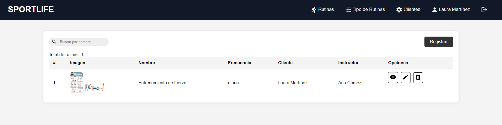

# FULL VENTAS PORTAL

## Login

    Cuenta del administrador 
        - usuario: administrador
        - contraseña: administrador

    Cuentas de los sintructores
        - usuario: instructor1
        - contraseña: instructor1

        - usuario: instructor2
        - contraseña: instructor2

        - usuario: instructor3
        - contraseña: instructor3

## Dashboard principal

    Tendrá las siguientes funcinalidad 
        - rutina: Crear, editar, actualizar y eliminar la rutina de cualquier instructor.
        - tipoDeRutina: Crear, editar, actualizar y eliminar el tipo de rutina

### Formulario para rutina
Para registrar una nueva rutina tendrá que ingresar los campos que se muestran en la imagen, este formulario se diferencia del instructor porque aquí se debe ingresar el id del instructor.

### Formulario para tipo de rutina
Este crud solo estará permitido para el rol de administrador.

